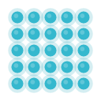

# NetFlash

<p align="center">
  
</p>

<p align="center">
  <strong>A menu-bar color that tells the truth about WAN quality</strong><br>
  when your laptop is tethered to a flaky phone hotspot.
</p>

<p align="center">
  <a href="https://github.com/EssekerDev/NetFlash/releases/latest"></a>
  
  
</p>

The macOS Wi‑Fi icon answers *“am I associated with an access point?”* On a phone hotspot that is almost always **yes** — even in a train tunnel, with 1 bar, or when TCP is stalled for 20 seconds.

NetFlash answers a different question: **can this machine reach the public internet usefully, right now?** Tiny HTTPS + DNS probes, a conservative recovery (no lucky-packet green), a violet→blue gradient painted in the menu bar.

No account. No server. No telemetry.

## Install (macOS, Apple Silicon)

1. Download [`NetFlash-1.0.0-macos.zip`](https://github.com/EssekerDev/NetFlash/releases/latest).
2. Drop `NetFlash.app` into **Applications**.
3. First launch: right-click → **Open** (the build is unsigned).
4. A color indicator appears in the menu bar. There is no Dock icon.

**Left-click:** status · Pause · Version / Update · Quit  
**Right-click:** appearance skins

The version item stays `Version 1.0.0` while you are current. If GitHub has a newer release it becomes **Update** — one click replaces the app and relaunches.

## Skins

Every skin uses the **same status color** (violet → red → orange → green → blue). No rainbow.

| | Skin | |
| :---: | --- | --- |
|  | **Dot** | Default filled circle |
|  | **Matrix** | 5×5 LED panel |
|  | **Kawaii** | Rounded square + face (`●‿●` / `–_–` / `x_x`) |
|  | **Flower** | Daisy — petals follow status, cream heart |
|  | **Spark** | Four-point star |
|  | **Ring** | Donut; stroke thickness follows quality |
|  | **Bars** | Four bars; how many are lit follows quality |

Appearance is saved in `~/Library/Application Support/NetFlash/config.toml`.

## Develop

```bash
cargo test --workspace
cargo run -p netflash-app
cargo run -p netflash-icon --example dump_skins   # regenerates docs/skins
./scripts/package-macos.sh                        # dist/NetFlash-<version>-macos.zip
```

`--cli` / `--sim` run probes without a tray icon.
